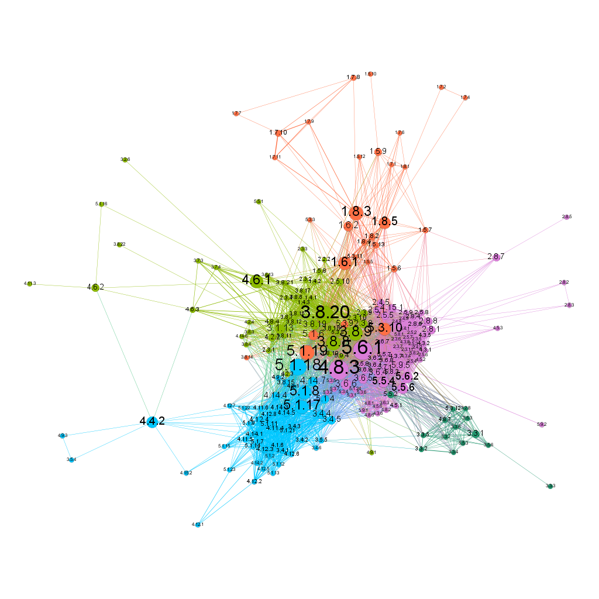

 ---
 title: "Les Miserables"
 author: "_Charles Schumacher_"
 date: "_10/4/18_"
 output: html_document
---

```{r}
library(knitr)
setwd("path")
read_chunk("les_mis.R")
knitr::opts_chunk$set(echo = TRUE)
```

### Loading the libraries
Incorporating GGally library to get the ggcorr function.
  
```{r C1, results="hide", warning=FALSE, message=FALSE}
```


### Load the Les Miserables data 
This network is a bipartite projection of character interactions in _Les Miserables_. Two characters are connected if there is an encounter within the book. 

```{r C2}
```


### Identify the bipartite structure 

Some nodes are book sections and some are people. Determine which is which and then create a 'type' attribute from the existing 'bipartite' attribute. The type attribute must have a boolean value.

```{r C3}
```


### Create section-to-section bipartite projection.

```{r C4}

```


### Display a histogram of the edge weights. 

```{r C5}

```


### Remove edges of weight 1. 

```{r C6}
```


### Calculate the set of connected components using decompose

```{r C7}

```


### Extract the subgraph containing just the giant component from the list returned by decompose.

```{r C8}

```


### Analysis 
How many sections of the book are removed in steps 5-7?

_The full section to section projection contains 284 sections of the book. After filtering edge weights and extracting the main component of the graph, there are 210 remaining sections of the book. Therefore this filtering process removed 74 sections of the original book._

What aspects of the book representation are altered through these steps?

_The section to section book projection creates a network representation that highlights sections of the book which are significant in terms of character interactions. The filtering of edges with weights equal to 1 removes the links which are less important, leaving only the sections which are most important for significant character encounters._

How should we understand the remaining network relative to the entire book that we started with?

_The remaining filtered component is a representation of sections of the book where there are significant encounters between different characters in the story. The story contains a lot of characters across different sections of the play, and this filtered projection isolates the sections where those characters meet or interact. This final network highlights sections which focus on characters rather than on history or politics, which are the focus of certain sections in the very large book._


### Display a summary of this extracted subgraph. 

```{r C9}

```


### Save the extracted subgraph to a graphml file.

```{r c10}

```


### Using the embedding syntax shown below, embed your PNG network visualization into the R markdown output. 

```{r}

```


### Question: Some nodes stand out as high betweenness (for example, 5.1.18, 4.8.3, and 1.8.3.)  What must be happening in the book in these sections in order for the betweenness of these sections to be relatively high? 

_The nodes which have high betweenness values represent sections of the book where characters from different sections meet. In Les Miserables, there are different groups of characters which comprise subplots which eventually inter-twine and characters from different story-lines eventually encounter each other or interact in some way. The larger nodes such as 5.1.18, 4.8.3, etc all represent sections where these different characters meet, and are valuable to the story in the sense that they bring the full narrative together._