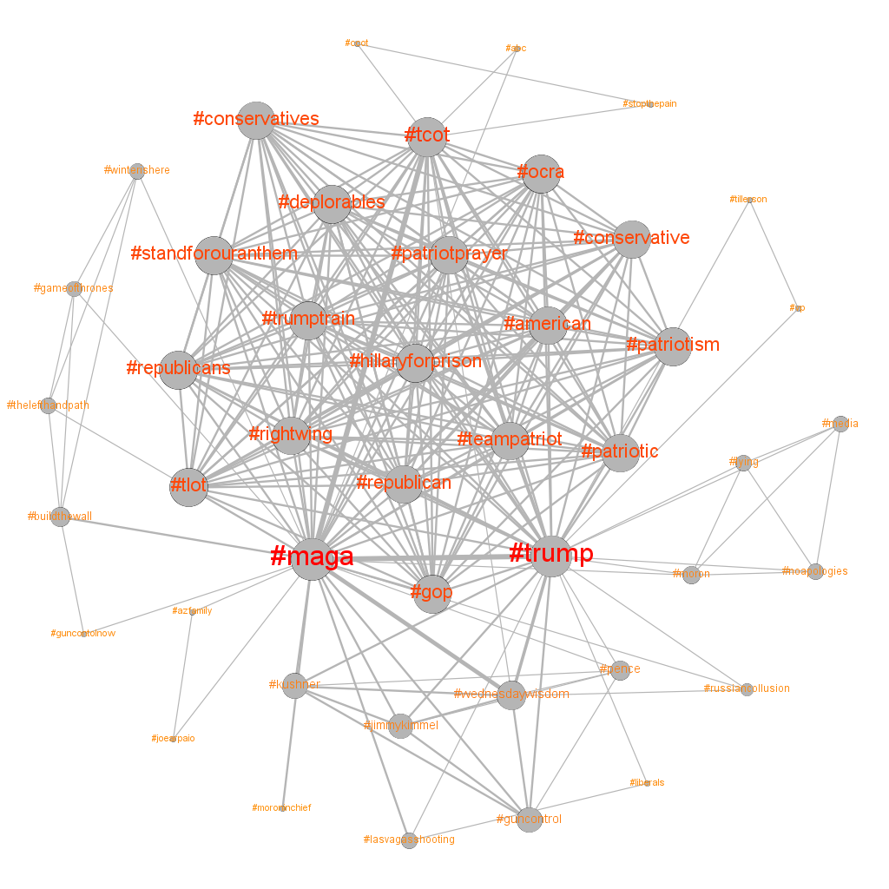
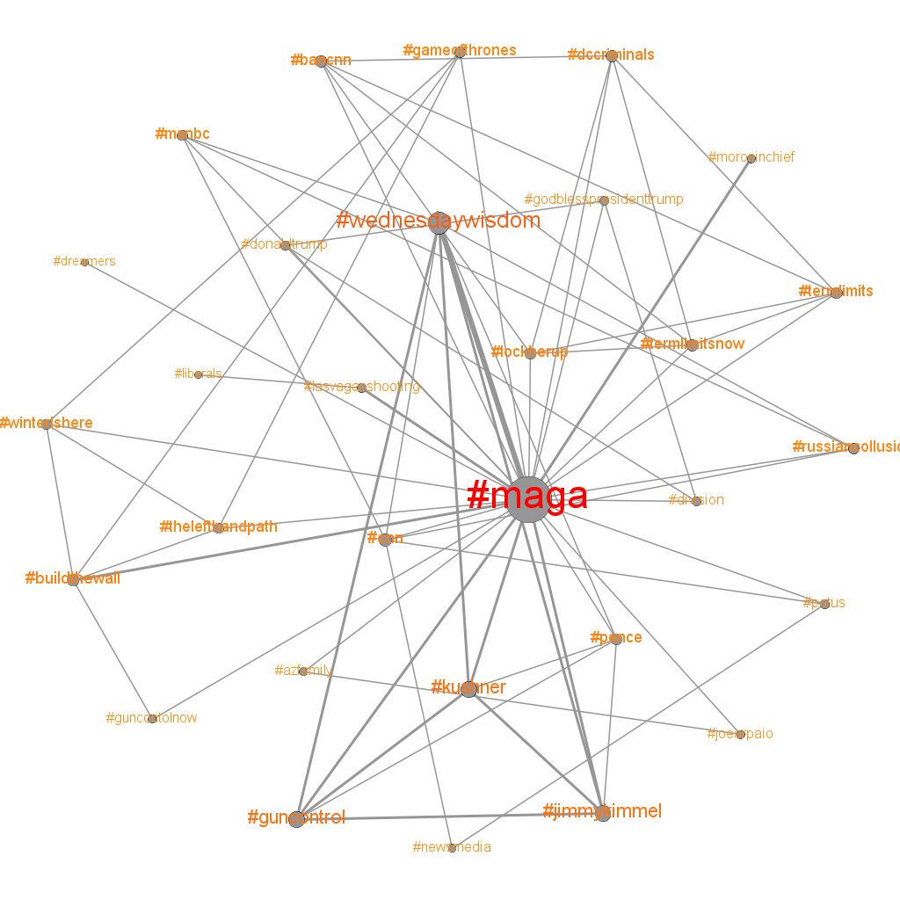

 ---
 title: "Twitter Election"
 author: "_Charles Schumacher_"
 date: "_10/9/18_"
 output: html_document
---

```{r}
library(knitr)
setwd("path")
read_chunk("hwk5.R")
knitr::opts_chunk$set(echo = TRUE)
```
## Part I: Simplifying the network
  
### Load the libraries
Incorporating GGally library to get the ggcorr function.
  
```{r C1, results="hide", warning=FALSE, message=FALSE}
```

### Load the twtter-2071004.graphml file 

```{r C2}
```


### Create a line plot of weighted degree with log-log axes


```{r C3}
```


### Remove the nodes with weighted degree equal to 1 or 2

```{r C4}

```


### Using the network from step 3, apply decompose and extract the giant component

```{r C5}

```

### Part II: Community Detection

### Set seed to a fixed value to ensure consistency of results with clustering methods

```{r C6}
```


### Run five community dtection algorithms on the network (use weights)

```{r C7}

```


### Compare the different clusteringts based on length (the number of clusters found) and modularity using bar charts 

```{r C8}

```


### Remove the result with the largest number of clusters. Use arandi() method on the four remaining metrics to compute the adjusted Rand index between all pairs of clusterings (6 total). Create a similarity matrix as in the in-class example and plot with ggcorr().

```{r C9}

```

### Use the communities from the Leading Eigenvector and Walktrap 10 algorithms for the rest of the assignment

```{r C10}

```


### Part III: Visualization

### From the network, chose a hashtag that you're interested in

```{r C11}
```


### Find the node associated with your hashtag

```{r C12}

```


### Find the cluster id from your chosen hashtag node in communities computed by LE and Walktrap 10

```{r C13}

```


### Extract the clusters containing your hashtag from LE and Walktrap 10 algorithms into separate networks using "induced.subgraph"

```{r C14}

```


### Plot each of the networks in igraph

```{r C15}

```


### Export these networks to graphml files and plot in Gephi, including the labels and sizing the nodes by weighted degree


### Save the image in two PNG files: hashtag1.pnh and hashtag2.png


### Embed the hashtag1.png and hastag2.png files in your R markdown file
Community detected which contained "#maga" hashtag through the Walktrap-10 method:
```{r}

```

Community detected which contained "#maga" hashtag through the Leading Eigenvector method:
```{r}

```

### Question: What aspects of political commmunication or particular news events do the clusters represent?

_The clusters identified in through both the Walktrap-10 and Leading Eigenvector which contain the "#maga" hashtag represent hot topics within right-wing / conservative media. Even though these terms were collected over a year after the 2016 election, there are several hashtags within the clusters which were specific to the election period. Hashtags such as "#hillaryforprison" and "#trumptrain" are examples of this, which are embedded in the highly dense cluster within the community discovered by the walktrap-10 method. The rest of the words in that very dense cluster all seem to correspond to conservative stances and attitudes and have a positive association to them; this makes sense since the #maga hashtag is dominantly used in a positive way by Trump supporters who also take pride in their values and would use multiple of these hashtags together. Interestingly, many of the hashtags discovered in this same walktrap-10 community which are outside of the highly dense cluster have negative connotations to them and very likely may have been used in a sarcastic way. Examples of these are "#russiancollusion", "#moronchief", "#lying", and "#winterishere". Many of these hashtags still appear in the discovered community by the Leading Eigenvector approach, but the overall community is smaller and there is not the same type of strucutre with several similar hashtags clustered together densely and others on the outside which may have used those hashtags in a different tone. In general, both of these communities depict a very polarized political landscape reflected in tweets._


### Which cluster makes the most "sense" to you as a grouping of terms? Why?

_The community discovered by the walktrap-10 method makes more intuitive sense. In particular, the way that many similar terms appear within a dense cluster of this community, and then less common hashtags on the outside (including some which would be used sarcastically in conjunction with the "#maga"" hashtag) makes a lot of visual and contextual sense. If I had to use one of these community graphs to explain the "#maga" hashtag and type of associated hashtags to someone, I would use the one generated by the walktrap-10 method._


### Combine hwk5.RMD, hwk5.R, hashtag1.png, hashtag2.png, and hwk5.html into a zip archive and submit